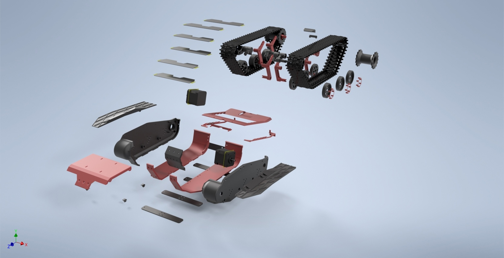

[English](README_EN.md)
# Rice-On-Salad
**Цель проекта:**
Разработать доступный для воспроизведения проект гусеничной платформы с возможностью удаленного управления через ПК 
и ориентации в пространстве через камеры.
****
**Описание:**
Полностью Open-Source проект с возможностью легкого повторения. Все детали для печати будут лежать в открытом доступе.
****
**Задачи проекта:**
- Разработать и собрать гусеничную платформу
- Подобрать необходимую электронику
- Реализовать удаленное управление платформой через ПК и смартфон
- Добавить автоматическое управление
****
**Желаемый результат:**
Получить полностью управляемую и самостоятельно ориентирующуюся в пространстве гусеничную платформу

***
# Установка ROS на Raspberry Pi
В данном разделе мы опишем процесс установки ROS на Raspberry Pi, а также расскажем о том, как подключить робота 
к своему компьютеру.

## Шаг 1.
Для работы Raspberry Pi требуется операционная система, которая хранится на карте microSD. 
В нашем проекте мы используем образ Ubuntu 16.04 с уже установленным ROS, 
который вы можете скачать по [ссылке](https://downloads.ubiquityrobotics.com/pi.html). 
Для записи образа на SD-карту вам потребуется программа [balenaEtcher](https://www.balena.io/etcher/).

## Шаг 2.
Для дальнейшей работы с Raspberry Pi вам нужно установить и настроить ROS на компьютере, 
с которого вы планируете подключаться к вашему роботу. 
Наиболее простой вариант — запустить образ Ubuntu с предустановленным ROS с помощью виртуальной машины.
1. Скачайте виртуальную машину [VirtualBox](https://www.virtualbox.org/wiki/Downloads) и установите её.
2. Скачайте образ Ubuntu по [ссылке](https://downloads.ubiquityrobotics.com/vm.html).
3. Разархивируйте файл, который вы скачали. В результате получится папка, внутри которой будет файл 
   с расширением `.vbox`. Запустите его. В результате откроется менеджер Virtual Box.
4. Проверьте параметры виртуальной машины и запустите её. Имя пользователя - `ubuntu`, пароль - `ubuntu`.

## Шаг 3.
Теперь, когда все необходимое ПО было установлено, рассмотрим процесс подключения к Raspberry Pi через SSH.
1. При первом включении Raspberry будет работать в режиме точки доступа Wi-Fi, к которой нужно будет подключиться 
   с вашего компьютера. Имя сети — `ubiquityrobotXXXX`, где `XXXX` - комбинация цифр. 
   Пароль для подключения - `robotseverywhere`.
2. После подключения к сети, откройте терминал в Ubuntu и введите команду `ssh ubuntu@10.42.0.1`. 
   Далее введите пароль `ubuntu`.
3. Для того чтобы в дальнейшем подключаться к роботу через вашу Wi-Fi сеть, нужно добавить её в список робота. 
   Для просмотра доступных сетей наберите команду `pifi list seen`. Для добавления вашей сети воспользуйтесь 
   командой `sudo pifi add MyNetwork password`, где `MyNetwork` и `password` - имя и пароль вашей сети. 
   Далее, введите `sudo reboot` в терминале. Это приведет к перезапуску робота, который теперь 
   будет автоматически подключаться к вашей сети.
4. Подключитесь к данной сети с вашего компьютера и снова откройте терминал Ubuntu. Теперь, чтобы подключиться к роботу, 
   воспользуйтесь командой `ssh ubuntu@address`, где `address` - IP-адрес вашего робота. Чтобы узнать его, 
   выполните следующие действия:
    1. Введите в терминале команду `ifconfig`. В ответ вы получите информацию по сетевым интерфейсам:
       
         ```
         eth0: flags=4099<UP,BROADCAST,MULTICAST>  mtu 1500
                 ether b8:27:eb:5b:d7:ae  txqueuelen 1000  (Ethernet)
                 RX packets 0  bytes 0 (0.0 B)
                 RX errors 0  dropped 0  overruns 0  frame 0
                 TX packets 0  bytes 0 (0.0 B)
                 TX errors 0  dropped 0 overruns 0  carrier 0  collisions 0
 
         lo: flags=73<UP,LOOPBACK,RUNNING>  mtu 65536
                 inet 127.0.0.1  netmask 255.0.0.0
                 inet6 ::1  prefixlen 128  scopeid 0x10<host>
                 loop  txqueuelen 1000  (Local Loopback)
                 RX packets 0  bytes 0 (0.0 B)
                 RX errors 0  dropped 0  overruns 0  frame 0
                 TX packets 0  bytes 0 (0.0 B)
                 TX errors 0  dropped 0 overruns 0  carrier 0  collisions 0
 
         wlan0: flags=4163<UP,BROADCAST,RUNNING,MULTICAST>  mtu 1500
                 inet 192.168.1.2  netmask 255.255.255.0  broadcast 192.168.1.255
                 inet6 fe80::1e3a:e952:1094:4fda  prefixlen 64  scopeid 0x20<link>
                 ether 00:e0:4c:06:6f:dc  txqueuelen 1000  (Ethernet)
                 RX packets 257  bytes 33734 (32.9 KiB)
                 RX errors 0  dropped 14  overruns 0  frame 0
                 TX packets 153  bytes 26653 (26.0 KiB)
                 TX errors 0  dropped 0 overruns 0  carrier 0  collisions 0
         ```           
       
       Обратите внимание на адрес `inet 192.168.1.2.`. IP-адрес Raspberry Pi будет иметь вид `192.168.1.x`, 
       где `x` - число от 1 до 255.
    2. Теперь, для того, чтобы найти адрес Raspberry Pi, можно воспользоваться 
       приложением [Advanced IP Scanner](https://www.advanced-ip-scanner.com). 
       Запустите приложение, введите `192.168.1.1-255` и нажмите "Сканировать". 
       В результате вы увидите список устройств, подключенных к вашей сети, среди которых будет и Raspberry.
5. Поздравляем! Вы подключились к своему роботу!

## Шаг 4.
Вполне вероятно, что в будущем вы захотите запускать часть нод на роботе, а часть на компьютере. 
Для этого настроим переменные среды.
1. Запустите виртуальную машину, откройте терминал и наберите следующие команды:
   
    ```
    echo "export ROS_MASTER_URI=http://<robot_ip>:11311" >> ~/.bashrc
    echo "export ROS_IP=$<workstation_ip>" >> ~/.bashrc
    ```
   
    где `<robot_ip>` и `<workstation_ip>` - IP-адреса робота и виртуальной машины соответственно.
2. Подключитесь к Raspberry Pi через SSH и наберите следующие команды:
   
    ```
    echo "export ROS_MASTER_URI=http://<robot_ip>:11311" >> ~/.bashrc
    echo "export ROS_IP=$<robot_ip>" >> ~/.bashrc
    ```

***
# Подключение шаговых двигателей к Arduino Uno с помощью CNC Shield
В данном разделе мы рассмотрим подключение шаговых двигателей к Arduino Uno, рассмотрим необходимые для этого 
компоненты и напишем небольшую тестовую программу.

## 1. Необходимые компоненты
1. CNC Shield v3.0
2. Arduino Uno
3. Драйверы A4988 - 2 шт.
4. Шаговые двигатели NEMA17 17HS4401 - 2 шт.
5. Шлейфы из 4 проводов для подключения шаговых двигателей - 2 шт.
6. USB-кабель для связи с компьютером

## 2. Соединение CNC Shield с Arduino Uno и драйверами
CNC Shield имеет четыре слота — для подключения четырех драйверов двигателей. Слоты, обозначенные желтым цветом, 
отвечают за оси X, Y, Z, красный слот — за ось A.


Ось A может дублировать одну из осей X, Y, Z с помощью дополнительного двигателя и драйвера. То есть входной сигнал 
приходит одинаковый, а драйверы и шаговые двигатели разные, но двигаются одинаково. В нашем случае 
дублирование осей не нужно, поэтому вставляем драйверы в 2 из 3 слотов X, Y, Z, а сам CNC Shield в Arduino Uno, 
как на картинке ниже.


## 3. Настройка тока драйверов
Для настройки дополнительно потребуются отвертка и мультиметр.

Сначала подключим сборку плат к компьютеру по USB. Далее, включаем на мультиметре измерение постоянного напряжения 
напротив положения “20”. Для измерения напряжения необходимо приложить минусовой щуп к минусу на CNC Shield, 
а положительный щуп замкнуть с подстроечным резистором, который по совместительству является "+" в данной схеме. 
Необходимо вращать подстроечный резитор, пока мультиметр не покажет требуемое значение напряжения, 
при вращении по часовой стрелке, значения растут, против часовой стрелки — напряжение падает. 

Настройку расчетных значений необходимо повторить это для всех активных драйверов в сборке. В нашем случае 
мультиметр должен показать 1.01 В. 

Основные моменты процесса настройка показаны на рисунке ниже:


## 4. Подключение шаговых двигателей
Провода от шаговых двигателей подключаются последовательно в данный разъем:


## 5. Распиновка при подключении CNC Shield


**Важно!** По умолчанию CNC Shield подает на 8 пин Stepper Enable/Disable высокий сигнал, который отключает драйвера, 
поэтому для их работы в программе необходимо прописать следующие строчки:

```
pinMode(8, OUTPUT);
difitalWrite(8, LOW);
```

Также мы можем подавать высокий сигнал на 8 пин, чтобы отключить режим удержания позиции двигателями, 
когда не нужно двигаться, чтобы не тратить лишнюю энергию. Главное — не забыть включить их перед началом движения.

## 6. Библиотека AccelStepper
Для управления шаговыми двигателями мы используем библиотеку AccelStepper.

Установка библиотеки:
1. Скачиваем библиотеку с [сайта](http://www.airspayce.com/mikem/arduino/AccelStepper/index.html)
2. Скачанный zip архив добавляем в Arduino IDE следующим образом:
   
    Скетч > Подключить Библиотеку > Добавить .ZIP библиотеку  > выбираем скачанный архив > open

Использование библиотеки:
1. подключение библиотеки
`#include <AccelStepper.h>`

2. подключения шагового двигателя через драйвер(согласно распиновки):
   
    ```
    AccelStepper Xaxis(1, 2, 5);
    AccelStepper Yaxis(1, 3, 6);
    AccelStepper Zaxis(1, 4, 7);
    ```

3. Установка максимальной скорости:
`Xaxis.setMaxSpeed(stepsPerSecond);`

4. Установка максимального ускорения:
`Xaxis.setMaxAcceleration(stepsPerSecondSquared);`

5. Переместиться в абсолютно указанное положение. Само движение запускается функцией run():
`Xaxis.moveTo(targetPosition);`

6. Переместиться в относительно указанное положение. Само движение запускается функцией run():
`Xaxis.move(distance);`

7. Вернуть текущее абсолютное положение:
`Xaxis.currentPosition();`

8. Вернуть расстояние до указанного положения:
`Xaxis.distanceToGo();`

9. Начать движение. Для продолжения движения следует вызвать функцию повторно:
`Xaxis.run();`

10. Начать движение и подождать, когда двигатель достигнет указанной точки. Функция не осуществляет возврата, пока двигатель не остановится:
`Xaxis.runToPosition();`

11. Установить скорость в шагах в секунду. Само движение запускается функцией runSpeed():
`Xaxis.setSpeed(stepsPerSecond);`

12. Начать движение. Для продолжения движения следует вызвать функцию повторно:
`Xaxis.runSpeed();`

## 7. Тестовая программа
```
#include <AccelStepper.h> //подключение библиотеки

//установка двигателей
AccelStepper Xaxis(1, 2, 5); // pin 2 = step, pin 5 = direction
AccelStepper Yaxis(1, 3, 6); // pin 3 = step, pin 6 = direction

void setup() {
  //включение драйверов
  pinMode(8, OUTPUT);
  digitalWrite(8, LOW);
  //установка максимальной скорости
  Xaxis.setMaxSpeed(1000);
  Yaxis.setMaxSpeed(1000);
  //установка скорости движения
  Xaxis.setSpeed(500);
  Yaxis.setSpeed(-800);
}

void loop() {
   //запуск двигателей с заданной скоростью  
   Xaxis.runSpeed();
   Yaxis.runSpeed();
}
```

***
# История разработки гусеницы
**Начальная задача:** придумать оптимальные гусеницы для робоплатформы.  
**Основные параметры:**
 - Ширина гусеницы 
 - Расстояние между центрами вращения траков.  

Если касаемо ширины трака все было довольно однозначно: берем среднее соотношение ширины траков и корпуса у вездеходов 
средней весовой категории, что составило 0.67 (сумма ширины траков к ширине корпуса без учета траков), то есть 
при заданной ширине 150 мм ширина каждого трака составила 50 мм.

Длина трака подбиралась под диаметр ведущего колеса, в чем очень помог Советский учебник по расчету гусеничных шасси 
(“Расчет и конструирование гусеничных машин Н.А. Носова издательство “Машиностроение” Ленинград 1972”).

После определения параметров пришло время определиться с зацеплением.  

В первом прототипе использовалось захождение 2 в 3 ушка, однако от этого было решено отказаться из-за большого масштаба 
и недостаточного разрешения FDM 3D печати.  

Вторым прототипом было зацепление 1 в 2 ушка, которое и было выбрано для дальнейшей работы.

Кроме того, был переработан паз для зацепления с ведущим катком.

Для первой версии были использованы квадратные окна, повторяющие профиль зуба в серединном сечении, которые 
не обеспечивали достаточного захождения зацепного зуба на колесе в трак, а так же обеспечивали слишком 
малый контакт зацепления, что могло привести к прокручиванию и разуванию гусеницы.

Для второго прототипа были выбраны торчащие по бокам гусеницы штыри, которые размещались в полость между зубцами колеса, 
что обеспечивает отличный контакт и хорошее вхождение в зацепление. Таким образом, 2 версия уже является хорошим траком 
из-за легкости, прочности, воспроизводимости на FDM принтере и зацепляемости проволкой от 0.8 до 1.2 мм в диаметре.

К 3-м тракам 2-й версии было напечатано 24 трака 3-й версии для оценки соединений на большом количестве траков, а так же 
общей гибкости и упругости гусеничного полотна.

Дальнейшие изменения трака лишь вносили небольшие коррективы. Третий прототип немногим отличается от второго. Было 
добавлено 2 отверстия в траке, которые в дальнейшем позволят дооснащать гусеничное полотно различными грунтозацепами, 
повышая приспособленность гусеницы под различные условия без необходимости изготовления новой.

Четвертой и финальной версией был закрыт вопрос с препятствованием разуванию и оптимальному взаимодействию 
с опорными катками. Было добавлено два зуба толщиной по 1.5 мм на расстоянии 19 мм, что при печати из PETG пластика 
обеспечивает достаточную прочность для сопротивления к поперечным нагрузкам и размещению и прокатыванию между ними 
опорного катка шириной 18.8 мм.  


***

# Компоновка
При создании какой-либо сложной системы первоочередной и основополагающей задачей должна быть компоновка элементов.

При решении этой задачи необходимо четко понимать:
 - Какие элементы будут в системе 
 - Способы их воздействия на систему 
 - Массу (для некоторых случаев)  

Так как в начале разработки нашего робота не было четкого понимания того, какие элементы нужны, какие моторы 
будут использоваться, модель создавалась с запасом.

Когда уже был готов корпус, рассчитан гусеничной движитель и продумана подвеска, появилось представление 
о начинке нашего дрона. Первоначально задумывалось использование 2-х легких бк двигателей для приведения системы 
в рабочее положение, которые должны были располагаться в передней части корпуса. Собственно под них был спроектирован 
специальный отсек.

Однако, позже, для решения задачи точного позиционирования нашей системы был осуществлен переход на шаговые двигатели, 
которые были больше и тяжелее первоначально выбранных. В корпусе пришлось сделать пропилы, а двигатели слишком сильно 
перемещали центр масс дрона вперед. При разгоне это даже хорошо, ведь корпус не кренило назад, но при торможении 
вся система стремилась перевернуться, несмотря на внушительный противовес в кормовой части дрона.

Также для гостиничного движителя не так благоприятно размещение ведущего колеса спереди, нежели сзади. Вот почему 
ведущий каток, расположенный в кормовой части натягивает полотно гусеницы со стороны поверхности по которой едет, 
при движении в основном направлении-вперед. Если ведущее колесо расположено спереди, то при движении вперед оно 
натягивает полотно гусеницы по верхней части движителя и стремится протолкнуть гусеницу вниз между 
опорными катками и поверхностью, что может повлечь за собой холостое проворачивание ведущего колеса 
при слабом натяжении гусеницы. Также расположение ведущего колеса сзади позволяет разместить двигатели в кормовой части. 
Это позволит нивелировать опрокидывающий момент при резком торможении.

В конечном итоге мы разместили шаговые двигатели и ведущие колеса в задней части дрона, что позволило лучше реализовать 
работу подвески.

Теперь основная масса находится в кормовой части, хоть и дрон не переворачивается необходимо сместить центр тяжести 
как можно ближе к центру дрона. Мы установили аккумулятор и все управляющие элементы максимально близко к передней части, 
теперь наша конструкция не переворачивается и максимально эффективно реализует работу гусеничного движителя.





***
# Управление роботом с клавиатуры
В данном разделе мы расскажем, как подключить Raspberry Pi к Arduino через UART-интерфейс, а также напишем программу 
для управления роботом с помощью клавиатуры.

Для начала необходимо активировать UART на Raspberry Pi. Для этого подключитесь к микрокомпьютеру через SSH и наберите 
в терминале команду `sudo nano /boot/config.txt`. В открывшемся файле добавьте в конец строку `enable_uart=1`. Далее, 
выполните ребут с помощью команды `sudo reboot`, чтобы изменения вступили в силу.

Теперь нужно определить имя Arduino при подключении через USB. Наберите в терминале `ls /dev/tty*`. Вы увидите 
список адресов. Сделайте скриншот (он пригодится, чтобы найти адрес Arduino). После этого подключите Arduino к 
Raspberry Pi через USB и снова наберите эту команду. В списке должен появиться новый адрес, соответствующий Arduino 
(в нашем случае этот адрес имел вид `/dev/ttyACM0`). Запомните его, он пригодится нам при написании программы.

Приступим к написанию управляющей программы.

Начнем с создания узла ROS, который будет считывать нажатия на клавиши и передавать их Arduino для управления двигателями.

```
$ cd ~/catkin_ws/src
$ catkin_create_pkg control_node rospy geometry_msgs.msg
```

Последняя команда создаст новый ROS-пакет с названием `control_node` и зависимостями `rospy` и `geometry_msgs`.
Далее, наберите:

```
$ cd control_node
$ mkdir scripts
$ cd scripts
$ nano control_node.py
``` 

В результате откроется редактор.
Наберите в нем код из [данного файла](programs/ros/control_node.py). Учтите, что в `arduino_name` должен быть адрес, 
полученный вами ранее. После этого, выполните:

```
$ chmod +x control_node.py
$ ~/catkin_ws
$ catkin_make
```

В результате все пакеты в catkin_workspace будут собраны и готовы к запуску.

Теперь напишем скетч для Arduino. Подключите Arduino к вашему компьютеру, откройте Arduino IDE и создайте программу 
с содержанием из [этого файла](programs/arduino/sketch_keyboard_control.ino).

Осталось протестировать нашу программу. Запустите программу на Arduino и подключитесь к Raspberry Pi через USB. 
Затем откройте второй терминал. В одном из них наберите `rosrun control_node control_node.py` - эта команда запустит 
написанный нами узел. В другом наберите `rosrun teleop_twist_keyboard teleop_twist_keyboard.py`.

На экране должно появиться следующее:

```
Reading from the keyboard  and Publishing to Twist!
---------------------------
Moving around:
   u    i    o
   j    k    l
   m    ,    .

For Holonomic mode (strafing), hold down the shift key:
---------------------------
   U    I    O
   J    K    L
   M    <    >

t : up (+z)
b : down (-z)

anything else : stop

q/z : increase/decrease max speeds by 10%
w/x : increase/decrease only linear speed by 10%
e/c : increase/decrease only angular speed by 10%

CTRL-C to quit
```

Теперь при нажатии на одну из клавиш выше робот начнет двигаться.

Поздравляем! Вы успешно написали программу для управления роботом с клавиатуры!

# Управление роботом со смартфона
В данном разделе мы рассмотрим управление роботом с использованием мобильного приложения.

## Шаг 1. Установка дробления шага
Для установки необходимого дробления шага установим перемычки на пины под драйверами. В нашем случае установим 1/8 шага,
вставляя перемычки в MS0 и MS1. Теперь 1 шаг в программе будет равен 8-ой части от полного шага, соответственно, нужно 
увеличить значения скоростей в 8 раз.


## Шаг 2. Подключение Bluetooth-модуля
Для подключения Bluetooth-модуля воспользуемся местом для установки драйвера ось Z.
 - белый — земля
 - светло-серый — 5 В
 - серый — rx Arduino tx модуля
 - жёлтый — tx Arduino rx модуля


## Шаг 3. Полезные ссылки
 - https://3dtoday.ru/blogs/xedos/sandbox-cnc-shield-v30-iron/
 - http://cnc-design.ru/sborka-arduino-uno-i-cnc-sheild-v3.html
 - https://3d-diy.ru/wiki/arduino-moduli/bluetooth-modul-hc-05/
 - https://hobbytech.com.ua/arduino-библиотека-accelstepper-для-шагового-двигател/

## Шаг 4. Мобильное приложение
Для дистанционного управления нашим роботом будем использовать мобильное приложение 
[Arduino Joystick](https://play.google.com/store/apps/details?id=uncia.robotics.joystick&hl=ru&gl=US).


После установки приложения необходимо подключиться к роботу для это сперва включите Bluetooth и добавить робота в 
сопряженные устройства. Имя - `RC-Caterpillar` (по умолчанию `HC-05`), пароль - `3317` (по умолчанию `0000` или `1234`).
Далее, в приложении нажимаем на иконку Bluetooth и выбираем нашего робота. 

Теперь, отклоняя джойстик, мы можем задавать скорость и направление движения нашего робота, а с помощью 3 кнопок 
(красная, синяя и желтая) задавать скоростные режимы роботу, а с помощью зеленой включать и выключать режим остановки 
перед препятствиями.

При необходимости в приложении доступна документация и некоторые настройки.

## Шаг 5. Остановка перед препятствиями
Для определения расстояния до ближайшего препятствия воспользуемся лидаром.

Сначала подключимся к Raspberry Pi через SSH.

Затем установим пакет rplidar_ros, который будет обрабатывать полученные с лидара данные и публиковать их 
в топик `\scan`:

```
$ cd ~/catkin_ws/src
$ git clone https://github.com/Slamtec/rplidar_ros.git
```

Далее, создадим новый пакет, который будет обрабатывать сообщения с лидара и передавать сигнал об остановке на Arduino:
```
$ catkin_create_pkg distance_node rospy sensor_msgs.msg
$ cd distance_node
$ mkdir scripts
$ cd scripts
$ nano distance_node.py
```

В открывшемся редакторе наберите код из [файла](programs/ros/distance_node.py). Далее,

```
$ chmod +x distance_node.py
$ cd ~/catkin_ws
$ catkin_make
$ source devel/setup.bash
```

Запустим наши программы. В первом терминале наберем `roslaunch rplidar_ros rplidar.launch`, во втором - 
`rosrun distance_node distance_node.py`.