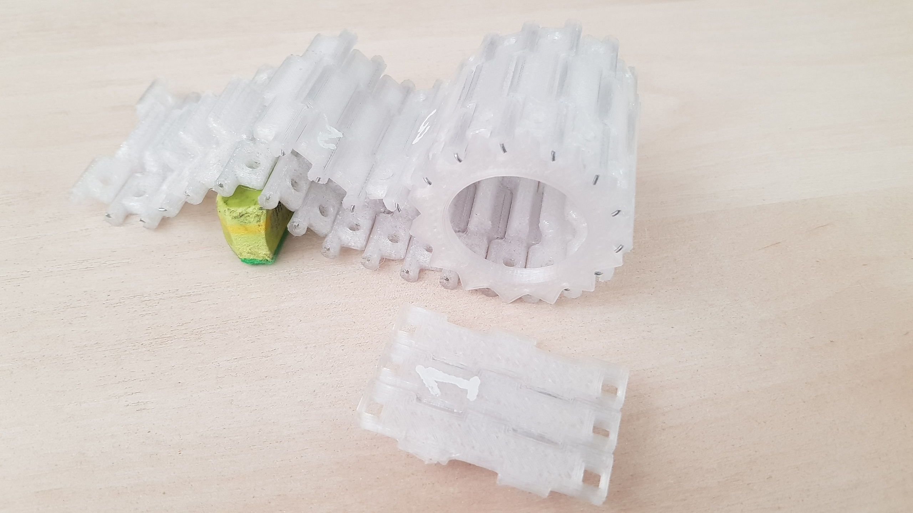

[Russian](README.md)
# Rice-On-Salad
**Objective of the project:**
Our goal is to develop a producible tracked platform project with the possibility of remote control via a PC and orientation in space via cameras.
****
**Description:**
It's fully Open-Source project with easy repeatability. All details for printing will be in the public domain.
****
**Project objectives:**
- Developing and assembling a tracked platform
- Choosing the necessary electronics
- Implementing remote platform control via PC
- Adding automatic controls
****
**Desired result:**
Get the fully controlled and independently oriented tracked platform.
***
<details>
    <summary>Track development Stages</summary>
    <p>Initial task: to come up with optimal tracks for the robot platform.</p>
    <p>Basic parameters: track width, distance between the centers of rotation of the tracks. </p>
    <p>Regarding to the width of the track, everything was quite unambiguous: we take the average ratio of the width of the tracks to the hull for off-road vehicles of the middle weight category, which was 0.67 (the sum of the width of the tracks to the width of the hull, excluding tracks), that is, for a given width of 150 mm, the width of each track was 50 mm.</p>
    <p>The length of the track was matched to the diameter of the drive wheel, which was greatly helped by the Soviet textbook on calculating tracked chassis. ( "Calculation and design of tracked vehicles NA Nosov Leningrad publishing" Engineering "1972")</p>
    <p>After defining the parameters, it's time to decide on the gearing.</p>
    <p>In the first prototype, 2-to-3 lugs were used, but it was decided to abandon this due to the large scale and insufficient resolution of FDM 3D printing.</p>
    <p>The second prototype was a 1-to-2 lug engagement, which was chosen for further work.</p>
    <p>In addition, the groove for engaging the drive roller has been redesigned.</p>
    <p>For the first version, square windows were used, repeating the profile of the tooth in the middle section, which did not provide sufficient engagement of the hooking tooth on the wheel in the track, as well as provided too little engagement contact, which could lead to scrolling and inflation of the caterpillar.</p>
    <p>For the second prototype, pins sticking out on the sides of the track were chosen, which are placed in the cavity between the teeth of the wheel, which provides contact and good engagement. Thus, version 2 is already a good track due to its lightness, strength, reproducibility on FDM, we hook with wire from 0.8 to 1.2 mm in diameter.</p>
    <p>For version 3 tracks, 24 version 3 tracks were printed to evaluate connections on a large number of tracks, as well as the flexibility and resilience of the track.</p>
    <p>Further changes to the track only made minor adjustments. The third prototype is not much different from the second. Two holes were added to the track, which will further allow the track bed to be retrofitted with different lugs, increasing the track's adaptability to different conditions without the need to make a new one.</p>
    <p>The fourth and final version closed the issue of preventing inflation and optimal interaction with road wheels. Two 1.5mm teeth have been added at 19mm spacing, which when printed from PETG plastic provides sufficient strength to resist lateral loads and accommodate and roll an 18.8mm track roller between them.</p>




</details>

***
# Installing ROS on Raspberry PI
In this article, we will describe the process of installing ROS on a Raspberry Pi, as well as how to connect a robot to your computer.

## Step 1.
The Raspberry Pi requires an operating system that is stored on a microSD card. In our project, we use an Ubuntu 16.04 image with already installed ROS, which you can download from the [link](https://downloads.ubiquityrobotics.com/pi.html). To write an image to an SD card, you need the [balenaEtcher](https://www.balena.io/etcher/) program.

## Step 2.
To further work with the Raspberry Pi, you need to install and configure ROS on the computer from which you plan to connect to your robot. The easiest option is to run an Ubuntu image with ROS preinstalled using a virtual machine.
1. Download the Virtual Machine [VirtualBox](https://www.virtualbox.org/wiki/Downloads) and install it.
2. Download the Ubuntu image from the [link](https://downloads.ubiquityrobotics.com/vm.html).
3. Unzip the file you downloaded. As a result, you will get a folder, inside which there will be a file with the `.vbox` extension. Start it up. This will open the Virtual Box Manager.
4. Check the parameters of the virtual machine and start it. The username is `ubuntu`, the password is` ubuntu`.

## Step 3.
Now that all the necessary software has been installed, let's look at the process of connecting to the Raspberry Pi via SSH.
1. When you turn it on for the first time, the Raspberry will work in the Wi-Fi hotspot mode, which you will need to connect to from your computer. The network name is `ubiquityrobotXXXX`, where` XXXX` is a combination of numbers. The password to connect is `robotseverywhere`.
2. Once connected to the network, open a terminal in Ubuntu and enter the command `ssh ubuntu @ 10.42.0.1`. Next enter the password `ubuntu`.
3. In order to further connect to the robot via your Wi-Fi network, you need to add it to the list. To view the available networks, type `pifi list seen`. To add your network, use `sudo pifi add MyNetwork password`, where` MyNetwork` and `password` are your network name and password. Next, enter `sudo reboot` in the terminal. This will restart the robot, which will automatically connect to your network.
4. Connect to this network from your computer and open the Ubuntu terminal again. To connect to the robot, use `ssh ubuntu @ address`, where` address` is the IP address of your robot. In order to find it out, follow these steps:
    1. Enter `ifconfig` in the terminal. As a response, you will receive information on the network interfaces:
        ```
        eth0: flags=4099<UP,BROADCAST,MULTICAST>  mtu 1500
                ether b8:27:eb:5b:d7:ae  txqueuelen 1000  (Ethernet)
                RX packets 0  bytes 0 (0.0 B)
                RX errors 0  dropped 0  overruns 0  frame 0
                TX packets 0  bytes 0 (0.0 B)
                TX errors 0  dropped 0 overruns 0  carrier 0  collisions 0

        lo: flags=73<UP,LOOPBACK,RUNNING>  mtu 65536
                inet 127.0.0.1  netmask 255.0.0.0
                inet6 ::1  prefixlen 128  scopeid 0x10<host>
                loop  txqueuelen 1000  (Local Loopback)
                RX packets 0  bytes 0 (0.0 B)
                RX errors 0  dropped 0  overruns 0  frame 0
                TX packets 0  bytes 0 (0.0 B)
                TX errors 0  dropped 0 overruns 0  carrier 0  collisions 0

        wlan0: flags=4163<UP,BROADCAST,RUNNING,MULTICAST>  mtu 1500
                inet 192.168.1.2  netmask 255.255.255.0  broadcast 192.168.1.255
                inet6 fe80::1e3a:e952:1094:4fda  prefixlen 64  scopeid 0x20<link>
                ether 00:e0:4c:06:6f:dc  txqueuelen 1000  (Ethernet)
                RX packets 257  bytes 33734 (32.9 KiB)
                RX errors 0  dropped 14  overruns 0  frame 0
                TX packets 153  bytes 26653 (26.0 KiB)
                TX errors 0  dropped 0 overruns 0  carrier 0  collisions 0
        ```           
       Note the `inet 192.168.1.2.` address. The Raspberry Pi's IP address will be `192.168.1.x`, where `x` is a number between 1 and 255.
    2. Now, in order to find the address of the Raspberry Pi, you can use the [Advanced IP Scanner](https://www.advanced-ip-scanner.com) application. Launch the application, enter `192.168.1.1-255` and click "Scan". As a result, you will see a list of devices connected to your network, among which there will be Raspberry.
3. Congratulations! You are connected to your robot!