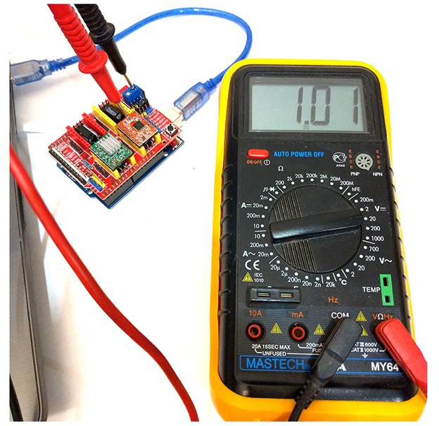
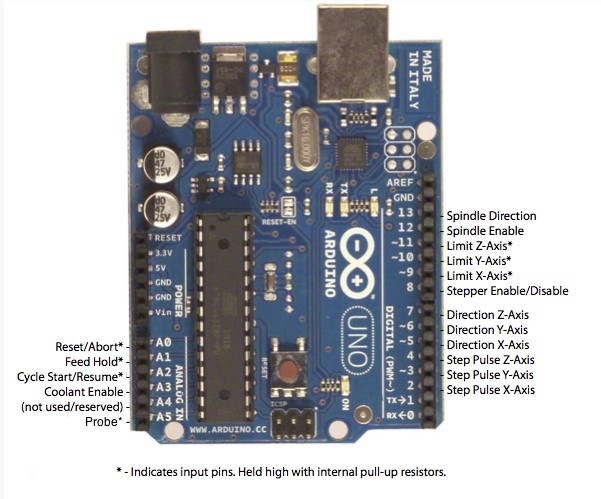

[Russian](README.md)
# Rice-On-Salad
**Objective of the project:**
Our goal is to develop a producible tracked platform project with the possibility of remote control via a PC and orientation in space via cameras.
****
**Description:**
It's fully Open-Source project with easy repeatability. All details for printing will be in the public domain.
****
**Project objectives:**
- Developing and assembling a tracked platform
- Choosing the necessary electronics
- Implementing remote platform control via PC
- Adding automatic controls
****
**Desired result:**
Get the fully controlled and independently oriented tracked platform.

***
# Installing ROS on Raspberry PI
In this article, we will describe the process of installing ROS on a Raspberry Pi, as well as how to connect a robot to your computer.

## Step 1.
The Raspberry Pi requires an operating system that is stored on a microSD card. In our project, we use an Ubuntu 16.04 image with already installed ROS, which you can download from the [link](https://downloads.ubiquityrobotics.com/pi.html). To write an image to an SD card, you need the [balenaEtcher](https://www.balena.io/etcher/) program.

## Step 2.
To further work with the Raspberry Pi, you need to install and configure ROS on the computer from which you plan to connect to your robot. The easiest option is to run an Ubuntu image with ROS preinstalled using a virtual machine.
1. Download the Virtual Machine [VirtualBox](https://www.virtualbox.org/wiki/Downloads) and install it.
2. Download the Ubuntu image from the [link](https://downloads.ubiquityrobotics.com/vm.html).
3. Unzip the file you downloaded. As a result, you will get a folder, inside which there will be a file with the `.vbox` extension. Start it up. This will open the Virtual Box Manager.
4. Check the parameters of the virtual machine and start it. The username is `ubuntu`, the password is` ubuntu`.

## Step 3.
Now that all the necessary software has been installed, let's look at the process of connecting to the Raspberry Pi via SSH.
1. When you turn it on for the first time, the Raspberry will work in the Wi-Fi hotspot mode, which you will need to connect to from your computer. The network name is `ubiquityrobotXXXX`, where` XXXX` is a combination of numbers. The password to connect is `robotseverywhere`.
2. Once connected to the network, open a terminal in Ubuntu and enter the command `ssh ubuntu @ 10.42.0.1`. Next enter the password `ubuntu`.
3. In order to further connect to the robot via your Wi-Fi network, you need to add it to the list. To view the available networks, type `pifi list seen`. To add your network, use `sudo pifi add MyNetwork password`, where` MyNetwork` and `password` are your network name and password. Next, enter `sudo reboot` in the terminal. This will restart the robot, which will automatically connect to your network.
4. Connect to this network from your computer and open the Ubuntu terminal again. To connect to the robot, use `ssh ubuntu @ address`, where` address` is the IP address of your robot. In order to find it out, follow these steps:
    1. Enter `ifconfig` in the terminal. As a response, you will receive information on the network interfaces:
        ```
        eth0: flags=4099<UP,BROADCAST,MULTICAST>  mtu 1500
                ether b8:27:eb:5b:d7:ae  txqueuelen 1000  (Ethernet)
                RX packets 0  bytes 0 (0.0 B)
                RX errors 0  dropped 0  overruns 0  frame 0
                TX packets 0  bytes 0 (0.0 B)
                TX errors 0  dropped 0 overruns 0  carrier 0  collisions 0

        lo: flags=73<UP,LOOPBACK,RUNNING>  mtu 65536
                inet 127.0.0.1  netmask 255.0.0.0
                inet6 ::1  prefixlen 128  scopeid 0x10<host>
                loop  txqueuelen 1000  (Local Loopback)
                RX packets 0  bytes 0 (0.0 B)
                RX errors 0  dropped 0  overruns 0  frame 0
                TX packets 0  bytes 0 (0.0 B)
                TX errors 0  dropped 0 overruns 0  carrier 0  collisions 0

        wlan0: flags=4163<UP,BROADCAST,RUNNING,MULTICAST>  mtu 1500
                inet 192.168.1.2  netmask 255.255.255.0  broadcast 192.168.1.255
                inet6 fe80::1e3a:e952:1094:4fda  prefixlen 64  scopeid 0x20<link>
                ether 00:e0:4c:06:6f:dc  txqueuelen 1000  (Ethernet)
                RX packets 257  bytes 33734 (32.9 KiB)
                RX errors 0  dropped 14  overruns 0  frame 0
                TX packets 153  bytes 26653 (26.0 KiB)
                TX errors 0  dropped 0 overruns 0  carrier 0  collisions 0
        ```           
       Note the `inet 192.168.1.2.` address. The Raspberry Pi's IP address will be `192.168.1.x`, where `x` is a number between 1 and 255.
    2. Now, in order to find the address of the Raspberry Pi, you can use the [Advanced IP Scanner](https://www.advanced-ip-scanner.com) application. Launch the application, enter `192.168.1.1-255` and click "Scan". As a result, you will see a list of devices connected to your network, among which there will be Raspberry.
3. Congratulations! You are connected to your robot!  

***
# Connecting stepper motors to Arduino Uno using CNC Shield
In this section, we will look at connecting stepper motors to the Arduino Uno, consider the components required for this, and write a small test program.

## Required components
1. CNC Shield v3.0
2. Arduino Uno
3. A4988 Drivers - 2 pcs.
4. Stepper motors NEMA17 17HS4401 - 2 pcs.
5. Loops of 4 wires for connecting stepper motors - 2 pcs.
6. USB cable for communication with a computer

## Connecting CNC Shield with Arduino Uno and Drivers
CNC Shield has four slots for connecting four motor drivers. The slots marked in yellow are responsible for the X, Y, Z axes, the red slot is for the A axis.


The A axis can duplicate one of the X, Y, Z axes with the help of an additional motor and driver. That is, the input signal comes the same, but the drivers and stepper motors are different, but they move the same way. In our case, there is no need to duplicate the axes, so we insert the drivers into 2 of 3 slots X, Y, Z, and the CNC Shield itself into the Arduino Uno, as in the picture below.


## Setting the driver current
For adjustment, you will additionally need a screwdriver and a multimeter.
First, let's connect the board assembly to the computer via USB. Next, we turn on the DC voltage measurement on the multimeter opposite the “20” position.
To measure the voltage, it is necessary to attach the negative probe to the minus on the CNC Shield, and close the positive probe with a trimming resistor, which is also "+" in this circuit.
It is necessary to rotate the trimmer until the multimeter shows the required voltage value, when rotating clockwise, the values increase, counterclockwise - the voltage drops.
Adjusting the calculated values must be repeated for all active drivers in the assembly.
In our case, the multimeter should show 1.01 V
The main points of the setup process are shown in the figure below:



## Connecting stepper motors


## Pinout when connecting CNC Shield



The wires from the stepper are connected in series to this connector.
**Important!** By default, CNC Shield sends a high signal to 8 pin Stepper Enable / Disable, which disables the drivers, so for them to work in the program, you need to write the following lines:
```
pinMode(8, OUTPUT);
difitalWrite(8, LOW);
```
We can also send a high signal to 8 pins to turn off the position holding mode by the motors, when there is no need to move, so as not to waste extra energy.  
The main thing is not to forget to turn them on before starting the movement.

## AccelStepper Library
We use the AccelStepper library to control stepper motors.  
Installing the library:  
1. Download the library from [site] http://www.airspayce.com/mikem/arduino/AccelStepper/index.html)
2. The downloaded zip archive is added to the Arduino IDE as follows:
   Sketch > Connect Library > Add .ZIP library > Select the downloaded archive > Open
Using the library:
1. library connection
   `#include <AccelStepper.h>`

2. connecting a stepper motor via the driver (according to the pinout):
```
AccelStepper Xaxis(1, 2, 5);
AccelStepper Yaxis(1, 3, 6);
AccelStepper Zaxis(1, 4, 7);
```

3. Setting the maximum speed:
   `Xaxis.setMaxSpeed(stepsPerSecond);`

4. Setting the maximum acceleration:
   `Xaxis.setMaxAcceleration(stepsPerSecondSquared);`

5. Move to the absolutely specified position. The movement itself is started by the run function:
   `Xaxis.moveTo(targetPosition);`

6. Move to a relatively specified position. The movement itself is started by the run() function:
   `Xaxis.move(distance);`

7. Return the current absolute position:
   `Xaxis.currentPosition();`

8. Return distance to specified position:
   `Xaxis.distanceToGo();`

9. Start driving. To continue moving, call the function again:
   `Xaxis.run();`

10. Start driving and wait for the engine to reach the specified point. The function does not return until the motor has stopped:
    `Xaxis.runToPosition();`

11. Set the speed in steps per second. The movement itself is started by the runSpeed() function:
    `Xaxis.setSpeed(stepsPerSecond);`

12. Start driving. To continue moving, call the function again:
    `Xaxis.runSpeed();`

## Test program
```
#include <AccelStepper.h> // library connection 

// installation of engines
AccelStepper Xaxis(1, 2, 5); // pin 2 = step, pin 5 = direction
AccelStepper Yaxis(1, 3, 6); // pin 3 = step, pin 6 = direction

void setup() {
  // enabling drivers 
  pinMode(8, OUTPUT);
  digitalWrite(8, LOW);
  // setting maximum speed 
  Xaxis.setMaxSpeed(1000);
  Yaxis.setMaxSpeed(1000);
  // setting the driving speed 
  Xaxis.setSpeed(500);
  Yaxis.setSpeed(-800);
}

void loop() {
   // starting motors at a given speed 
   Xaxis.runSpeed();
   Yaxis.runSpeed();
}
```

***
# Track development
**The Initial task is** to come up with the optimal tracks for the robotic platform.  
**Main settings:**
- Track width
- Distance between the centers of rotation of the tracks.  

Basic parameters: track width, distance between the centers of rotation of the tracks.  
Regarding to the width of the track, everything was quite unambiguous: we take the average ratio of the width of the tracks to the hull for off-road vehicles of the middle weight category, which was 0.67 (the sum of the width of the tracks to the width of the hull, excluding tracks), that is, for a given width of 150 mm, the width of each track was 50 mm.  
The length of the track was matched to the diameter of the drive wheel, which was greatly helped by the Soviet textbook on calculating tracked chassis. ( "Calculation and design of tracked vehicles NA Nosov Leningrad publishing" Engineering "1972")  
After defining the parameters, it's time to decide on the gearing.  
In the first prototype, 2-to-3 lugs were used, but it was decided to abandon this due to the large scale and insufficient resolution of FDM 3D printing.  
The second prototype was a 1-to-2 lug engagement, which was chosen for further work.  
In addition, the groove for engaging the drive roller has been redesigned.  
For the first version, square windows were used, repeating the profile of the tooth in the middle section, which did not provide sufficient engagement of the hooking tooth on the wheel in the track, as well as provided too little engagement contact, which could lead to scrolling and inflation of the caterpillar.  
For the second prototype, pins sticking out on the sides of the track were chosen, which are placed in the cavity between the teeth of the wheel, which provides contact and good engagement. Thus, version 2 is already a good track due to its lightness, strength, reproducibility on FDM, we hook with wire from 0.8 to 1.2 mm in diameter.  
For version 3 tracks, 24 version 3 tracks were printed to evaluate connections on a large number of tracks, as well as the flexibility and resilience of the track.  
Further changes to the track only made minor adjustments. The third prototype is not much different from the second. Two holes were added to the track, which will further allow the track bed to be retrofitted with different lugs, increasing the track's adaptability to different conditions without the need to make a new one.  
The fourth and final version closed the issue of preventing inflation and optimal interaction with road wheels. Two 1.5mm teeth have been added at 19mm spacing, which when printed from PETG plastic provides sufficient strength to resist lateral loads and accommodate and roll an 18.8mm track roller between them.  


***

# Layout
When creating any complex system, the main task should be the layout of the elements.  
It is necessary to clearly understand:
- What elements will be in the system
- How they affect the system
- Mass (for some cases)

Since at the beginning of the development of our robot there was no clear understanding of what elements are needed, what motors will be used, the model was created with a margin.  
When the body was already ready, the tracked propulsion unit was calculated and the suspension was thought out, an idea appeared about the stuffing of our drone. Initially, it was conceived to use 2 light BL engines to bring the system into working position, which were to be located in the front of the hull. Actually, a special compartment was designed for them.   
However, to solve the problem of accurate positioning of our system, a transition was made to stepper motors, which were larger and heavier than those originally selected. Cuts had to be made in the hull, and the engines moved the drone's center of mass forward too much. During acceleration, this is even good, because the body did not roll back, but when braking, the entire system tried to roll over, despite the impressive counterweight in the rear of the drone.   
Also, for a hotel propulsion device, it is not so favorable to place the drive wheel in the front, rather than in the back. That is why the drive roller, located in the aft part, pulls the track belt from the side of the surface on which it travels, when moving in the main direction-forward. If the drive wheel is located at the front, then when moving forward, it pulls the track bed along the top of the propeller and seeks to push the track down between the road wheels and the surface, which can entail idle rotation of the drive wheel with a weak track tension. Also, the location of the drive wheel at the rear allows the engines to be placed aft. This will eliminate the overturning moment during heavy braking.    
Finally, we placed the stepper motors and drive wheels at the rear of the drone, allowing for better suspension performance.  
Now the main mass is in the aft part, although the drone does not turn over, it is necessary to shift the center of gravity as close to the center of the drone as possible. We installed the battery and all the control elements as close to the front as possible, now our structure does not roll over and realizes the work of the caterpillar propeller as efficiently as possible.  


***
# Robot control
In this section, we will explain how to connect the Raspberry Pi to the Arduino via the UART interface, and also write a program to control the robot using the keyboard.

First, we need to enable the UART on the Raspberry Pi.
To do this, connect to the microcomputer via SSH and type `sudo nano /boot/config.txt` in the terminal.
In the file that opens, add `enable_uart=1` to the end. Next, reboot with the `sudo reboot` for the changes to take effect.

Now we need to determine the name of the Arduino when connected via USB. Type in the terminal `ls /dev/tty*`.
You will see a list of addresses. Take a screenshot (it will come in handy to find the Arduino address). After that, connect the Arduino to the Raspberry Pi via USB and type this command again.
A new address corresponding to the Arduino should appear in the list (in our case, this address looked like `/dev/ttyACM0`). Remember it, it will be useful to us when writing a program.

### Writing a control program

Let us start by creating a ROS node that will read the keystrokes and send them to the Arduino to control the motors.
```
$ cd ~/catkin_ws/src
$ catkin_create_pkg control_node rospy geometry_msgs.msg
```
The last command will create a new ROS package named `control_node` and dependencies `rospy` and `geometry_msgs`.
Then, type:
```
$ cd control_node
$ mkdir scripts
$ cd scripts
$ nano control_node.py
``` 
This will open the editor.
Enter the [file](programs/ros/control_node.py) code in it. Note that the `arduino_name` must contain the address you received earlier. After that, run:
```
$ ~/catkin_ws
$ catkin_make
```
As a result, all packages in catkin_workspace will be built and ready to run.

Now let us write a sketch for the Arduino. Connect the Arduino to your computer, open the Arduino IDE and create a sketch there with the content from the [file](programs/arduino/sketch_keyboard_control.ino).

It remains to test our program. Run the program on the Arduino and connect to the Raspberry Pi via USB. Then, open a second terminal.
In one of them, type `rosrun control_node control_node.py`- this command will start the node we wrote. In another, type `rosrun teleop_twist_keyboard teleop_twist_keyboard.py`.
The following should appear on the screen:
```
Reading from the keyboard  and Publishing to Twist!
---------------------------
Moving around:
   u    i    o
   j    k    l
   m    ,    .

For Holonomic mode (strafing), hold down the shift key:
---------------------------
   U    I    O
   J    K    L
   M    <    >

t : up (+z)
b : down (-z)

anything else : stop

q/z : increase/decrease max speeds by 10%
w/x : increase/decrease only linear speed by 10%
e/c : increase/decrease only angular speed by 10%

CTRL-C to quit
```
Now, when you press one of the keys above, the robot will start moving.

Congratulations! You have successfully written a program to control a robot from the keyboard! 